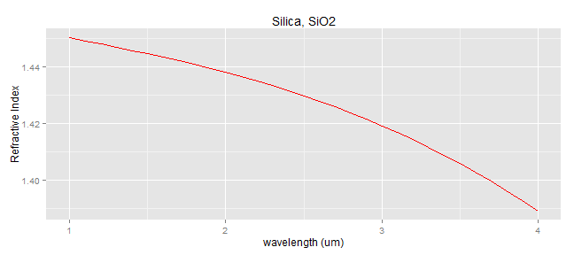

## Introduction
This presentation is part of the course project for module 9 - **"Developing Data Products"**. The project consists of two parts, where in the first part, we are require to create a simple and interactive shiny application and deploy it on Rstudio's servers. The second part requires us to produce a reproducible pitch presentation based on Slidify or Rstudio Presenter about the application that we have created. The presentation that you are reading now is to address for the second part of the course project.  

The shiny application that I have developed is available at:  
<https://dctee.shinyapps.io/project>  

Source code for ui.R and server.R files for the application are available on my GitHub:  
<https://github.com/teedinchai/m9_DDP>  

--- .class #id 

## Functions of My Shiny Application

This "**Light Guiding for Optical Communication**" shiny application is built for the purpose to help user to obtain some useful design parameters for optical communication which is based on utilizing light (electromagnetic wave) to transmit signal for communication purposes. This application requires user to select and keying inputs, then, it solves some formula/equation to obtain the output, finally, the calculated results are displayed for user.

This application first computes the refractive index of the material (medium for light transmission) from 1um to 4um wavelengths and display the refractive index vs wavelength graph for the specific optical material. It also calculates refractive index at a specific wavelength based on Sellmeier Equation after the user press the "calculate refractive index" button. 

Secondly, this application computes light guiding properties when the light travels from medium 1 entering into medium 2 with different refractive indices. From the refractive indices choosen by user, the application computes the critical angle for total internal reflection to happen, the speed of light in the medium, the reflectivity and transmission coefficient for normal incident (90degree, perpendicular to the interface between mediums) light. Finally, more data, parameters and equations can be included in the application, however, it is not consider for the current version.

--- .class #id

## Plot (Refractive Index vs Wavelength)
Example plot for refractive index (Silica) versus wavelength displayed on the application. Three other popular optical materials (silicon, GaAs and ZBLAN) are available for user to select. 

 
  
The refractive index at specific wavelength for the optical material is calculated for user:

```r
RI<-sqrt((0.6961663*L/(L-0.0684043^2))+(0.4079426*L/(L-0.1162414^2))+(0.8974794*L/(L-9.896161^2))+1)
```
Example: The refractive index for Silica, Si02 at wavelength of 1.55um is 1.4440236

--- .class #id


## Results On Optical Characteristics
The application acquires refractive indices for two materials from user and calculates the corresponding Critical Angle, Velocity of light in medium, Reflectivity and Transmission Coefficients for normal incident light which are important for light guiding in optical fiber and optical waveguide. 

```r
# Solving equation for important parameters
n1 <- 1.5  #first material
n2 <- 1  #second material
Critical_Angle <- (asin(n2/n1)) * 180/pi
LightSpeed <- 299792.458/n1
Rflectivity <- ((n2 - n1)/(n2 + n1))^2 * 100
Transmission <- (1 - ((n2 - n1)/(n2 + n1))^2) * 100
```
Computed Results:  
When light enters from medium n1 with refractive index 1.5 into medium n2 with refractive index 1.0, the critical angle is 41.8103149 degree, with light speed of 199861.638 km/s, reflectivity of 4% and transmission efficiency of 96%.  
